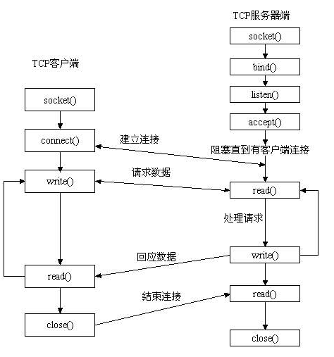
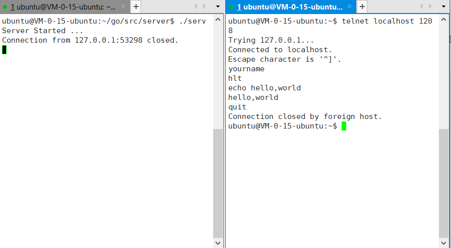

Socket 是对 TCP/UDP 封装后提供的一层接口, 可以利用 Socket 编写服务端和客户端, 然后让客户端和服务端建立 TCP 或 UDP 的连接.

### Unix Socket 编程的函数接口

在 Unix/Linux 中的 Socket 编程主要通过调用 `listen, accept, write read` 等函数来实现的. 具体如下图所示:



### Golang 中的 Socket 编程模型

和 Linux Socket 编程相比, go 的 Socket 编程就简单很多. 服务端直接通过 Listen + Accept 模式即可实现:

```Golang
//注使用的包要有net
func connHandler(c net.Conn) {
	for {
        cnt, err := c.Read(buf)
        c.Write(buf)
	}
}
func main() {
	server, err := net.Listen("tcp", ":1208")
	for {
		conn, err := server.Accept()
		go connHandler(conn)
	}
}
```

而客户端直接调用 Dial 即可:

```Golang
func connHandler(c net.Conn) {
	for {
		c.Write(...)
		c.Read(...)
	}
}
func main() {
	conn, err := net.Dial("tcp", "localhost:1208")
	connHandler(conn)
}
```

### 实现一个可以接受不同命令的服务端

可以接受以下命令：

- `yourname` 问名字命令，服务端会返回"hlt"
- `echo` 服务端会返回接收到的字符串
- `quit` 服务端收到这个命令后关闭连接

```Golang
package main

import (
	"fmt"
	"net"
	"string"
)

func connHandler(c net.Conn) {
	if c == nil {
		return
	}
	buf := make([]byte, 4096)
	for {
		cnt, err := c.Read(buf)
		if err != nil || cnt == 0 {
			c.Close()
			break
		}
		inStr := strings.TrimSpace(string(buf[0:cnt]))
		inputs := strings.Split(inStr, " ")
		switch inputs[0] {
		case "yourname":
			c.Write([]byte("hlt\n"))
		case "echo":
			echoStr := strings.Join(inputs[1:], " ") + "\n"
			c.Write([]byte(echoStr))
		case "quit":
			c.Close()
			break
		default:
			fmt.Printf("Unsupported command: %s\n", inputs[0])
		}
	}
	fmt.Printf("Connection from %v closed. \n", c.RemoteAddr())
}
func main() {
	server, err := net.Listen("tcp", ":1208")
	if err != nil {
		fmt.Printf("Fail to start server, %s\n", err)
	}
	fmt.Println("Server Started ...")
	for {
		conn, err := server.Accept()
		if err != nil {
			fmt.Printf("Fail to connect, %s\n", err)
			break
		}
		go connHandler(conn)
	}
}
```
编译上面的服务端代码并启动后, 用 telnet 测试下服务端是否正常工作, 结果如下图所示:



分别输入了三条命令:

- yourname
- echo hello,world
- quit

### 客户端的实现

可以实现一个客户端来和服务端进行通信, 实现类似 telnet 的功能, 代码如下:

```Golang
package main
import (
	"bufio"
	"fmt"
	"net"
	"os"
	"strings"
)
func connHandler(c net.Conn) {
	defer c.Close()
	reader := bufio.NewReader(os.Stdin)
	buf := make([]byte, 1024)
	for {
		input, _ := reader.ReadString('\n')
		input = strings.TrimSpace(input)
		if input == "quit" {
			return
		}
		c.Write([]byte(input))
		cnt, err := c.Read(buf)
		if err != nil {
			fmt.Printf("Fail to read data, %s\n", err)
			continue
		}
		fmt.Print(string(buf[0:cnt]))
	}
}
func main() {
	conn, err := net.Dial("tcp", "localhost:1208")
	if err != nil {
		fmt.Printf("Fail to connect, %s\n", err)
		return
	}
	connHandler(conn)
}
```

编译上面的代码，在一个窗口启动服务端一个启用客户端，就实现了通信。
