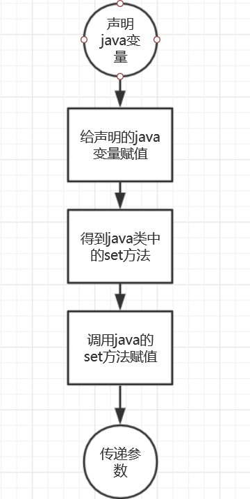

## NDK开发之javabean与C/C++交互编程


### 文档概述
JavaBeans是Java中一种特殊的类，可以将多个对象封装到一个对象（bean）中。特点是可序列化，提供无参构造器，提供getter方法和setter方法访问对象的属性。换句话说，如果要修改javabean中的成员变量那么必须调用Javabean提供的setter方法。

所以这篇文章主要讲述两个知识点:1.C/C++如何调用java类中的java方法。2.C/C++如何得到java类。

###用到点四个主要JNI函数简述
以C/C++中得到java的integer类为例

```C
//得到integer类
jclass integer = (*env)->FindClass(env, "java/lang/Integer");//找到java中声明integer的类方法

//获得java中Integer的构造函数方法,<init>为构造函数,V表明该构造函数为void型
//作用是得到java中的Integer类的set方法
jmethodID con_integer = (*env)->GetMethodID(env, integer, "<init>", "(I)V");

//假如我们要给一个变量赋予integer值
//调用con_integer指明的函数方法创建java的int型变量,并把33传给jint_xxx
jobject jint_xxx = (*env)->NewObject(env, integer, con_integer, 33);
```
看到这里我们需要的四个jni函数就介绍了3个了。

**FindClass:作用是找到java的类 GetMethodID:作用是得到java的方法或者说函数 NewObject:作用是声明新的变量**

那么对javabean中的成员函数做操作还需要一步
```C
//将string的值传递给jstr_Rx
jstring jstr_Rx = (*env)->NewStringUTF(env, string);
//找到java对应的set方法,第三个参数是方法名
set_Rx = (*env)->GetMethodID(env, bean, "setRx", "(Ljava/lang/String;)V");
if(set_Rx == NULL){
printf("没有找到 set_Rx 方法");
return NULL;
}
//调用set方法,把jstr_Rx的值传入到obj_bean中
(*env)->CallVoidMethod(env, obj_bean, set_Rx, jstr_Rx);//调用函数赋值
```

CallVoidMethod:作用是调用java中的方法。

具体的流程就如下图:


对应的函数调用则是FindClass->GetMethodID->NewObject->CallVoidMethod。
JAVA和JNI代码实际讲解
javabean的代码如下,该类中有两个成员变量str1和str2，接下来就讲解如何编写jni层的C代码与这份java代码交互，给str1和str2赋值。
```java
package com.venustech.hlt;

public class TestBean {

    private  String str1;
    private  String str2;

    public String getStr1() {
        return str1;
    }

    public void setStr1(String str1) {
        this.str1 = str1;
    }

    public String getStr2() {
        return str2;
    }

    public void setStr2(String str2) {
        this.str2 = str2;
    }

}
```

```C
#include <stdio.h>
#include <string.h>
#include <stdlib.h>
#include <jni.h>
//注意java的包名com.venustech.hlt和JNICALL的名字有对应关系
//jobject代表返回值是java类,该函数为RunTest无参数
//如果需要形参则需要在JNIEnv *env, jclass obj这两个默认参数后新增参数.如jint objint
//这样调用方式就会为RunTest(222);
JNIEXPORT jobject  JNICALL Java_com_venustech_hlt_JniService_RunTest(JNIEnv *env, jclass obj){
   printf("C code begin run\n");
   char str1[128] = {0};
   char str2[128] = {0};
   strcpy(str1, "hello world!");
   strcpy(str2, "hello jni!");
   
   //填数据
   //把str1的值赋给jstr_str1
   jstring jstr_str1 = (*env)->NewStringUTF(env, str1);
   jstring jstr_str2 = (*env)->NewStringUTF(env, str2);
   
   //声明一个java类
   jclass bean = NULL;
   //找到对应的TestBean
    bean = (*env)->FindClass(env, "com/venustech/hlt/TestBean");
    if(bean == NULL) {
        printf("can't find this bean\n");
    }
    //获得java类的set函数，javabean只有获得set函数才能赋值
    jmethodID set_str1 = NULL;
    jmethodID set_str2 = NULL;
    //下面解释下该步骤：
    //第2个参数bean为获得的对应的类，
    //setStr1是TestBean类对应的setStr1方法即第三个参数与函数名一致，
    //第四个参数(Ljava/lang/String;)V代表java中的setStr1方法的函数形参是string型
    //而它的返回值是void型
    set_str1 = (*env)->GetMethodID(env, bean, "setStr1", "(Ljava/lang/String;)V");
    if(set_str1 == NULL) {
        printf("没有找到set_str1方法");
        return NULL;
    }
    set_str2 = (*env)->GetMethodID(env, bean, "setStr2", "(Ljava/lang/String;)V");
    if(set_str2 == NULL) {
        printf("没有找到set_str2方法");
        return NULL;
    }
    //创建一个新类来存储类的值
    //得到javabean的构造方法
    jmethodID con_bean = (*env)->GetMethodID(env, bean, "<init>", "()V");
    if(con_bean == NULL){
	    printf("找不到构造方法");
	    return NULL;
    }
    //创建一个新类来存储目标的结果
    jobject obj_bean = (*env)->NewObject(env, bean, con_bean, "");
    if(obj_bean == NULL){
	    printf("创建实例失败\n");
	    return NULL;
    }
    
    
    //调用set方法给java类中的成员变量赋值，保存在obj_bean中
    (*env)->CallVoidMethod(env, obj_bean, set_str1, jstr_str1);
    (*env)->CallVoidMethod(env, obj_bean, set_str2, jstr_str2);
    //释放bean
    (*env)->DeleteLocalRef(env,bean);

    printf("c code exit\n");
    return obj_bean;
}
```
关键步骤解读
```C
    //下面解释下该步骤：
    //第2个参数bean为获得的对应的类，
    //setStr1是TestBean类对应的setStr1方法即第三个参数与函数名一致，
    //第四个参数(Ljava/lang/String;)V代表java中的setStr1方法的函数形参是string型
    //而它的返回值是void型
    set_str1 = (*env)->GetMethodID(env, bean, "setStr1", "(Ljava/lang/String;)V");
    if(set_str1 == NULL) {
        printf("没有找到set_str1方法");
        return NULL;
    }
```
然后把jni的C代码封装成so，java便可以调用该方法。调用方式如下:
```java
TestBean test = null;
test = new TestBean();
test = RunTest();
```
此时test里面的str1和str2就被赋值为"hello world!" 和 "hello jni!"