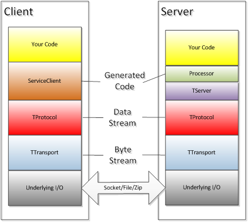
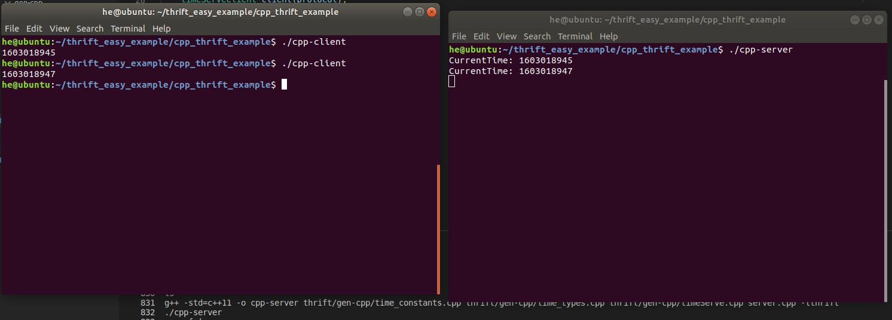
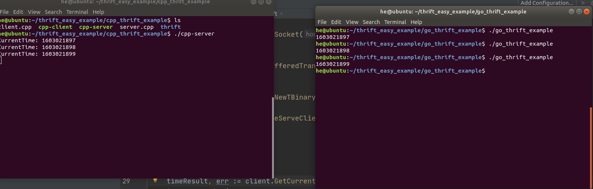

### Apache Thrift使用指南

thrift是一种rpc服务框架，先解释下rpc,rpc通俗来理解就是远程调用函数，相对于本地调用来说，只需要在主调函数中调用被掉函数即可。

#### thrift介绍

Thrift是一个用于创建可互操作和可伸缩服务的框架。Thrift最初是由Facebook开发的，并贡献给Apache以促进更广泛的使用。Thrift是在Apache 2.0许可下发布的。通过一种简单而直接的接口定义语言(IDL)， Thrift允许定义和创建可以被多种语言消费和使用的服务。通过thrift文件和代码可以让--Thrift创建一组文件，这些文件可以用来创建客户端和(或)服务器。除了互操作性之外，通过有效的独特序列化机制，Thrift也非常高效。

Facebook对编程语言的选择是基于哪种语言最适合手头的任务。虽然很实用，但是当这些应用程序需要相互调用时，这种灵活性带来了一些困难。经过分析，Facebook的工程师们没有发现任何现有的东西能够满足他们在互操作性、运输效率和简单性等方面的需求。出于这种需求，Facebook的工程师们开发出了高效的协议和服务基础设施，从而节约了成本。Facebook现在使用Thrift作为后端服务——这也是它为什么要这样做的原因。

#### 文章主题由四部分构成


#### Thrift的架构

Thrift拥有完整的创建客户端和服务器的技术栈。下图描述了Thrift堆栈。




Thrift采用的是C/S的模式，IDL文件生成了一部分服务器端和客户端的代码。

其中Processor是服务器端用来处理请求的，Client是给客户端发送请求的。

Tbase接口定义了数据如何方法和方法参数如何被序列化。

而更底层的TProtocol协议层定义了数据的传输格式，如二进制格式。

TTransport传输层，定义了传输方式，如TCP/IP方式，共享内存等。

thrift还包括一个服务器基础设施，将协议和传输绑定在一起。有阻塞、非阻塞、单线程和多线程服务器可用。

堆栈的“底层I/O”部分根据所讨论的语言而有所不同。比如对于Java和Python的网络I/O, Thrift库利用了语言内置库，而c++实现使用了自己的自定义实现。

下面详细解读一下thrift的协议栈:

- 底层IO模块，负责实际的数据传输，包括Socket，文件，或者压缩数据流等。

- TTransport负责以字节流方式发送和接收Message，是底层IO模块在Thrift框架中的实现，每一个底层IO模块都会有一个对应TTransport来负责Thrift的字节流(Byte Stream)数据在该IO模块上的传输。例如TSocket对应Socket传输，TFileTransport对应文件传输。

- TProtocol主要负责结构化数据组装成Message，或者从Message结构中读出结构化数据。TProtocol将一个有类型的数据转化为字节流以交给TTransport进行传输，或者从TTransport中读取一定长度的字节数据转化为特定类型的数据。如int32会被TBinaryProtocol Encode为一个四字节的字节数据，或者TBinaryProtocol从TTransport中取出四个字节的数据Decode为int32。

- TServer负责接收Client的请求，并将请求转发到Processor进行处理。TServer主要任务就是高效的接受Client的请求，特别是在高并发请求的情况下快速完成请求。

- Processor(或者TProcessor)负责对Client的请求做出相应，包括RPC请求转发，调用参数解析和用户逻辑调用，返回值写回等处理步骤。Processor是服务器端从Thrift框架转入用户逻辑的关键流程。Processor同时也负责向Message结构中写入数据或者读出数据。


#### Thrift支持的协议,传输方式和服务

由上述可知,我们使用thrift只需指明三个部分:需要使用什么协议,需要以什么方式进行传输,需要什么样的服务(服务分为两个部分TServer和Processor)。

#### TTransport

它描述了Thrift底层使用什么样的传输协议(这里叫做传输方式也许更合适)，一般都是TCP/IP协议，而在应用层上，它可以以使用Socket,File,Zip或HTTP。数据是按字节流(ByteStream)方式处理的，即传输层看到的是一个又一个的字节，并把这些字节按照顺序发送和接收。

它支持一下四种基础传输方式:

> TSocket：使用阻塞的TCP Socket进行数据传输，也是最常见的模式

> THttpTransport：采用Http传输协议进行数据传输

> TFileTransport：文件（日志）传输类，允许client将文件传给server，允许server将收到的数据写到文件中

> TZlibTransport：与其他的TTransport配合使用，压缩后对数据进行传输，或者将收到的数据解压

然后又支持4种基础模式的封装衍生出来的传输方式:

> TBufferedTransport：对某个Transport对象操作的数据进行buffer，即从buffer中读取数据进行传输，或者将数据直接写入buffer

> TFramedTransport：同TBufferedTransport类似，也会对相关数据进行buffer，同时，它支持定长数据发送和接收（按块的大小，进行传输）。

> TMemoryBuffer：从一个缓冲区中读写数据

#### TProtocol

TProtocol的主要任务是把TTransport中的字节流转化为数据流(Data Stream),在TProtocol这一层就会出现具有数据类型的数据，如整型，浮点数，字符串，结构体等。TProtocol中数据虽然有了数据类型，但是TProtocol只会按照指定类型将数据读出和写入，而对于数据的真正用途，需要在Thrift自动生成的Server和Client中里处理。

Thrift 可以让用户选择客户端与服务端之间传输通信协议的类别，在传输协议上总体划分为文本 (text) 和二进制 (binary) 传输协议，为节约带宽，提高传输效率，一般情况下使用二进制类型的传输协议为多数。常用协议有以下几种:

> TBinaryProtocol: 二进制格式

> TCompactProtocol: 高效率的、密集的二进制编码格式

> TJSONProtocol: 使用 JSON 的数据编码协议进行数据传输

> TSimpleJSONProtocol: 提供JSON只写协议, 生成的文件很容易通过脚本语言解析。

> TDebugProtocol: 使用易懂的可读的文本格式，以便于debug

TCompactProtocol 高效的编码方式，使用了类似于ProtocolBuffer的Variable-Length Quantity (VLQ) 编码方式，主要思路是对整数采用可变长度，同时尽量利用没有使用Bit。对于一个int32并不保证一定是4个字节编码，实际中可能是1个字节，也可能是5个字节，但最多是五个字节。TCompactProtocol并不保证一定是最优的，但多数情况下都会比TBinaryProtocol性能要更好。

#### 服务器之TServer

TServer主要作用是接收Client的请求，并转到某个TProcessor上进行请求处理。针对不同的访问规模,Thrift提供了不同的TServer模型。Thrift目前支持的Server模型包括：

> TSimpleServer：使用阻塞IO的单线程服务器，主要用于调试

> TThreadedServer：使用阻塞IO的多线程服务器。每一个请求都在一个线程里处理，并发访问情况下会有很多线程同时在运行。

> TThreadPoolServer：使用阻塞IO的多线程服务器，使用线程池管理处理线程。

> TNonBlockingServer：使用非阻塞IO的多线程服务器，使用少量线程既可以完成大并发量的请求响应，必须使用TFramedTransport。

处理大量更新的操作，主要是在`TThreadedServer`和`TNonblockingServer`中进行选择。`TNonblockingServer`能够使用少量线程处理大量并发连接，但是延迟较高；`TThreadedServer`的延迟较低。实际中，`TThreadedServer`的吞吐量可能会比`TNonblockingServer`高，但是`TThreadedServer`的CPU占用要比`TNonblockingServer`高很多。

#### 服务器之Processor

Processor是由Thrift生成的TProcessor的子类，主要对TServer中一次请求的 InputProtocol和OutputTProtocol进行操作，也就是从InputProtocol中读出Client的请求数据，向OutputProtcol中写入用户逻辑的返回值。Processor是TServer从Thrift框架转到用户逻辑的关键流程。同时TProcessor.process是一个非常关键的处理函数，因为Client所有的RPC调用都会经过该函数处理并转发。

具体的调用流程有如下三步：

1. `TServer`接收到RPC请求之后，调用`TProcessor.process`进行处理

2. `TProcessor.process`首先调用`TTransport.readMessageBegin`接口，读出RPC调用的名称和RPC调用类型。如果RPC调用类型是RPC Call，则调用`TProcessor.process_fn`继续处理，对于未知的RPC调用类型，则抛出异常。

3. `TProcessor.process_fn`根据RPC调用名称到自己的`processMap`中查找对应的RPC处理函数。如果存在对应的RPC处理函数，则调用该处理函数继续进行请求响应。不存在则抛出异常。

#### 一个C++作为服务器Go语言作为客户端的简单例子

首先编写`.thrift` 文件。定义为time.thrift

这里的service相当于是一个接口。在C++中相当于类,Go里面相当于包。而GetCurrentTime是包裹在类/包定义的函数,返回值是int32型。namespace是指定命名空间对于go语言而言是指定包名具体看代码就明白了。

```thrift
namespace go TimeServe
namespace cpp TimeServe

service timeServe {
    i32 GetCurrentTime()
}
```

执行如下命令,生成gen-cpp里面的代码。

`thrift --gen cpp time.thrift`

注意我的代码结构,我把thrift文件放在一个对应的thrift文件夹内然后在thrift文件夹内(执行指令)生成了对应的代码,这样就会有一个良好的代码结构。

```
cpp_thrift_example
|
|-----thrift
|		|___gen-cpp
|		|		|-----time_constants.cpp
|		|		|-----time_constants.h
|		|		|-----time_types.cpp
|		|		|-----time_types.h
|		|		|-----timeServe_server.skeleton.cpp
|		|		|-----timeServe.cpp
|		|		|-----timeServe.h
|		|---time.thrift
|		
|------client.cpp
|
|------server.cpp
```

注意到service里面定义的生成了timeServe.cpp。名字是相对应的。

下面编写服务端代码:由上面的理论可知。
服务器需要

1. 重写服务定义的方法函数GetCurrentTime

2. 指定processor处理流程(把还未定义道德GetCurrentTime注册到处理流程)

3. 指定传输方式(transport)

4. 指定是否需要特殊传输方式(TBufferedTransport，TFramedTransport，TMemoryBuffer) 可选操作

5. 指定协议

6. 拉起服务器

```C++
#include <thrift/protocol/TBinaryProtocol.h>
#include <thrift/server/TSimpleServer.h>
#include <thrift/transport/TServerSocket.h>
#include <thrift/transport/TBufferTransports.h>

#include "./thrift/gen-cpp/timeServe.h"

using namespace apache::thrift;
using namespace apache::thrift::protocol;
using namespace apache::thrift::transport;
using namespace apache::thrift::server;

using std::shared_ptr;
using namespace TimeServe; // 指定生成的thrift通信代码的命名空间

const int port_number = 9090;

// 实现thrift文件定义的方法(包裹到类里)
class TimeServerHandler : virtual public timeServeIf
{
public:
    TimeServerHandler()
    {
        // 构造函数
    }
    // 实现thrift定义的GetCurrentTime函数
    int32_t GetCurrentTime()
    {
        auto t = time(nullptr);
        printf("CurrentTime: %ld\n", t);
        return t;
    }
};

int main(int argc, char **argv)
{
    int port = port_number;
    // 指定processor,transport,protocol以及需要注册到服务器的函数
    shared_ptr<TimeServerHandler> handler(new TimeServerHandler());
    shared_ptr<TProcessor> processor(new timeServeProcessor(handler));
    shared_ptr<TServerTransport> server_transport(new TServerSocket(port));
    shared_ptr<TTransportFactory> transport_factory(new TBufferedTransportFactory());
    shared_ptr<TProtocolFactory> protocol_factory(new TBinaryProtocolFactory());

    TSimpleServer server(processor, server_transport, transport_factory, protocol_factory);
    server.serve();

    return 0;
}


```

编译指令如下:

`g++ -std=c++11 -o cpp-server thrift/gen-cpp/time_constants.cpp thrift/gen-cpp/time_types.cpp thrift/gen-cpp/timeServe.cpp server.cpp -lthrift`

客户端代码如下:

```C++
#include <iostream>

#include <thrift/protocol/TBinaryProtocol.h>
#include <thrift/transport/TSocket.h>
#include <thrift/transport/TTransportUtils.h>

#include "thrift/gen-cpp/timeServe.h"

using namespace apache::thrift;
using namespace apache::thrift::protocol;
using namespace apache::thrift::transport;
using std::shared_ptr;

int main()
{
    // 实例化socket
    auto p = new TSocket("127.0.0.1", 9090);
    shared_ptr<TTransport> socket(p);

    // 选择传输方式Socket/HTTP/File
    auto q = new TBufferedTransport(socket);
    shared_ptr<TTransport> transport(q);

    // 选择要序列化成什么样的方式
    auto r = new TBinaryProtocol(transport);
    shared_ptr<TProtocol> protocol(r);

    TimeServe::timeServeClient client(protocol); // 这里是包裹在TimeServe里面的命名空间由thrift自动生成的client代码

    // 建立连接
    transport->open();
    auto time_now = client.GetCurrentTime();
    std::cout << time_now << std::endl;
    transport->close();

    return 0;

}
```
编译指令如下:
注意客户端需要的源代码少了很多,原因在于函数方法是在服务器端的，客户端仅需要知道存在的方法名GetCurrentTime即可。

`g++ -std=c++11 -o cpp-client thrift/gen-cpp/timeServe.cpp client.cpp -lthrift`

运行服务端和客户端,效果图如下:




`thrift --gen go time.thrift ` 这里做一个说明最好在执行前加一个-r，`thrift -r --gen go time.thrift`。因为有可能time.thrift文件依赖于另一个文件,-r选项指打包所有的thrift文件。

go的客户端代码结构如下(同样是在保存time.thrift的文件夹下执行生成代码的指令): 

```
go_thrift_example
|
|-----thrift
|		|___gen-cpp--
|		|		|---time
|		|			|-------time_serve-remote
|		|			|				|------time_serve-remote.go
|		|			|-------GoUnusedProtection__.go
|		|			|-------time-consts.go
|		|			|-------time.go
|		|			
|		|---time.thrift
|		
|------client.go
```
go语言的client.go代码如下:

```Go
package main

import (
	"context"
	"fmt"
	"go_thrift_example/thrift/gen-go/TimeServe" // 与namespace go TimeServe对应
	"github.com/apache/thrift/lib/go/thrift"
	"os"
)

var ctx = context.Background()

func main() {
	// 得到socket实例
	socket, err := thrift.NewTSocket("127.0.0.1:9090")

	// 选择传输方式
	transport := thrift.NewTBufferedTransport(socket, 8192)

	// 选择传输协议
	protocolFactory := thrift.NewTBinaryProtocolFactoryDefault()
	// 连接客户端
	client := TimeServe.NewTimeServeClientFactory(transport, protocolFactory)

	// 打开连接
	transport.Open()
	defer socket.Close()
	// 调用服务器上注册过的函数
	timeResult, err := client.GetCurrentTime(ctx)
	if err != nil {
		fmt.Println(err.Error())
		os.Exit(2)
	}
	fmt.Println(timeResult)

}
```

效果图如下:

