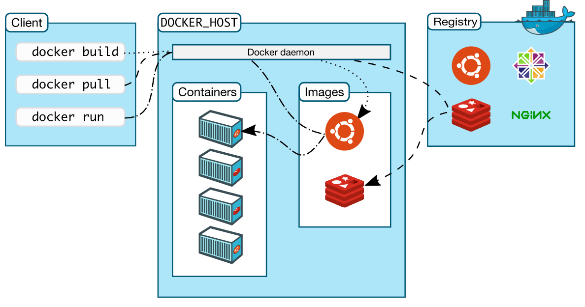

# docker入门使用指南

## docker架构图



用户访问的是client,然后提交命令比如

```Shell
docker pull/push/build/rmi ....
```

docker pull是从镜像仓库下载镜像能下载nginx,redis,ceph,centos等。push是推送自己的镜像到仓库(如果你有账号的话)。

docker的服务端(可以理解为docker本体或者核心)有一个daemon镜像负责下载镜像和推送镜像等。它管理本地镜像(images)和容器(containers)。然后运行`docker run`便是加载本地镜像到容器内部。

## Linux下安装docker

换阿里镜像源或者清华源。

参照 https://docs.docker.com/engine/install

- 安装docker

以ubuntu20为例。(因为我的电脑装的20).这里采取最常用的使用存储库进行安装

设置存储库

```bash
#1. 更新apt包索引并安装包以允许apt通过HTTPS使用存储库:
sudo apt-get update 
sudo apt-get install \
    apt-transport-https \
    ca-certificates \
    curl \
    gnupg-agent \
    software-properties-common

#2. 增加Docker的官方GPG密钥:
curl -fsSL https://download.docker.com/linux/ubuntu/gpg | sudo apt-key add -

# 通过搜索指纹的最后8个字符，验证您现在拥有指纹9DC8 5822 9FC7 DD38 854A E2D8 8D81 803C 0EBF CD88的密钥。
sudo apt-key fingerprint 0EBFCD88
# 添加库
sudo add-apt-repository \
   "deb [arch=amd64] https://download.docker.com/linux/ubuntu \
   $(lsb_release -cs) \
   stable"
```

安装docker
```bash
sudo apt-get update
sudo apt-get install docker-ce docker-ce-cli containerd.io
```

安装完成后验证并启动docker
```bash
docker -v # 查看docker版本号
systemctl start docker # docker启动
docker info # 查看docker详细状态信息
```

## docker常用操作

- 拉取镜像

```bash
# 下载官方nginx镜像源(等同于docker pull docker.io/nginx)
docker pull nginx
# 下载国内的ubuntu镜像源
docker pull registry.docker-cn.com/library/ubuntu:18.04
```

- 推送镜像

```bash
# 推送镜像到docker hub
docker push <你的用户名>/<你打包时定义的镜像名>:<标签,版本号>
# 推送到私有镜像仓库,需要提前搭好仓库服务(比如harbor来搭建)
docker push <私有镜像库域名>/<项目名称>/镜像名:<标签>
```

- 打包镜像

```bash
# 提前准备好一个Dockerfile,在相同路径下执行
docker build -t <指定一个完整的镜像名,比如testsvr:v1.0>
# 即可打包出一个本地镜像源,然后通过docker push就可以推送到远程镜像仓库
```

- 启动容器

```bash
docker run -d # -d表示通过daemon方式来启动
-p 13306:3306 # 端口映射,将host主机的13306端口和docker容器的3306端口映射起来
-v /etc/mysql:/var/mysql # 目录挂载,j将容器内的/var/mysql目录挂载到host主机的/etc/mysql目录,可以实现容器内这个目录的数据持久化
mysql # 镜像名,指定容器加载的镜像
```

- 重启或停止或删除容器应用

```bash
docker ps 					# 列出目前正在运行的容器列表
docker ps -a 				# 列出所有的容器列表
docker ps start <容器id>    # 通过容器id来启动某个容器,批量操作的话,直接在参数后面再跟对应的容器id即可
docker ps stop <容器id>		# 关闭容器,同上
docker ps rm <容器id>		# 删除已经停止的容器
docker ps rm -f <容器id>		# 强制删除容器
```
- 删除本地镜像

```bash
docker rmi <镜像id>
docker rmi -f <镜像id> # 强制删除
```

- 查看容器日志

```bash
docker logs -f <容器id>
docker inspect <容器id> # 从返回结果中找到LogPath,运行的历史日志会在这个文件里找到
```

- 进入容器内

```bash
docker exec -it <容器id> /bin/bash # 进入容器内并进入它的shell终端

docker exec -it <容器id> <shell命令> # 在容器内执行shell命令

docker exec -it <容器id> ls -l # 查看容器内系统根目录下所有文件或文件夹

# 进入容器后,可直接通过exit命令退出容器
```