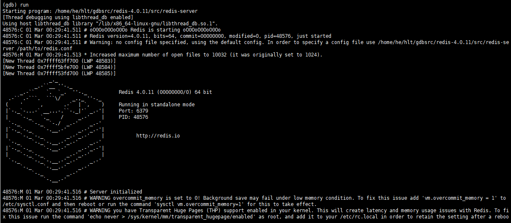
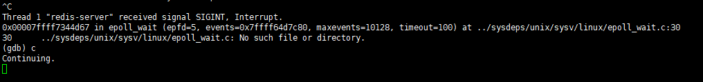
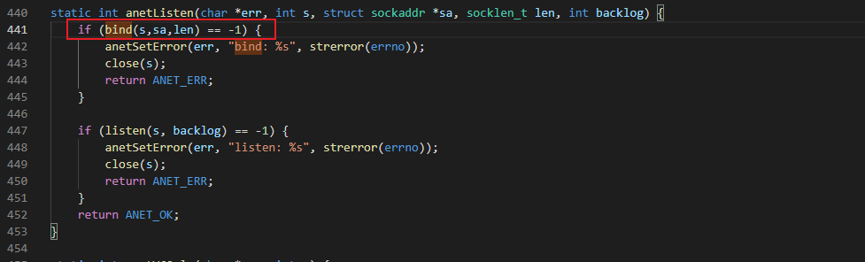

## 一文弄明白gdb调试 

## 1.gdb主要做什么

调试,查看符号表以及生成的汇编指令。

使用gdb的前置操作:
为了调试程序清晰地看到调试的每一行代码,调用堆栈信息,变量名和函数名等信息,需要调试程序含有调试符号信息。使用gcc或者g++编译的时候需要加上**-g**选项这样就可在编译后的程序中保留**调试符号信息**。

我用到的代码都在 https://github.com/helintongh/The-technique-of-debugging-with-GDB/tree/master/src 能够找到。

下载上面网址中的所有源代码文件。

```bash
gcc -g -o hello_server hello_server.c
```

```bash
gdb hello_server 
# 下面是输出结果
GNU gdb (Ubuntu 8.1-0ubuntu3.2) 8.1.0.20180409-git
Copyright (C) 2018 Free Software Foundation, Inc.
License GPLv3+: GNU GPL version 3 or later <http://gnu.org/licenses/gpl.html>
This is free software: you are free to change and redistribute it.
There is NO WARRANTY, to the extent permitted by law.  Type "show copying"
and "show warranty" for details.
This GDB was configured as "x86_64-linux-gnu".
Type "show configuration" for configuration details.
For bug reporting instructions, please see:
<http://www.gnu.org/software/gdb/bugs/>.
Find the GDB manual and other documentation resources online at:
<http://www.gnu.org/software/gdb/documentation/>.
For help, type "help".
Type "apropos word" to search for commands related to "word"...
Reading symbols from hello_server...done.
(gdb) 
```

gdb加载成功后**-g**选项编译出来的可执行文件会有Reading symbols from hello_server...done.这句话。不加**-g**则会变为Reading symbols from hello_server...(no debugging symbols found)...done.

我建议每次编译都加-g选项,因为加了过后直接利用Linux的strip命令就可以移除调试信息了。

```bash
strip hello_server
```

`在实际生成调试程序时,一般不仅要加上-g选项,也建议关闭编译器的程序优化选项。编译器的程序优化选项一般有五个级别,从O0-O4(注意第一个O0 ，是字母O加上数字0,O0表示不优化，从O1~O4 优化级别越来越高。O4最高。关闭编译器优化选项这样做的目的是为了调试的时候，符号文件显示的调试变量等能与源代码完全对应起来。`

## 2.gdb三种调试方式

gdb调试主要有**三种**方式:

- gdb filename `直接调试目标程序`
- gdb attach pid `attach到pid进程进行调试`
- gdb filename corename `调试core文件`

在阐述直接调试之前先讲一下core文件的调试。其中attach调试和直接调试类似,只需要注意一点退出时使用detach指令然后再quit退出gdb这一就不会影响attach的进程继续运行。

### 2.1调试core文件

很多服务器程序运行一段时间后会崩溃,这不是软件工程师喜欢看到的。只要程序在崩溃的时候有core文件生成,就可以使用这个core文件来定位崩溃的原因。

首先需要打开Linux的core文件机制,

`ulimit -c`查看系统是否开启了这一机制。

```bash
ulimit -c
# 为0则没有开启

# 下面的命令是直接修改能生成core dump文件且不限制其大小
ulimit -c unlimited 
```

下面看如下代码:

```c
#include <stdio.h>

int main(void)
{
    printf("hello world! dump core for set value to NULL pointer\n");

    *(char *)0 = 0;

    return 0;
}
```

```bash
gcc -g -o core_dump core_dump.c
./core_dump
# 出现段错误
```

用ll查看当前目录,会发现生成了一个core文件。

直接调试

```bash
gdb core_dump core
# 生成如下结果
...
[New LWP 37857]
Core was generated by `./core_dump'.
Program terminated with signal SIGSEGV, Segmentation fault.
#0  0x0000559f26da564f in main () at core_dump.c:7
7	    *(char *)0 = 0;
```
core dump的核心转储文件的目录和命名可以在Linux中控制。这里不多赘述。下图是指定核心转储文件的目录和命名需要修改的配置。


要明白为什么需要core dump线上环境你要直接调试进程会让服务停止,而core dump则是能在线上服务不停止的情况下进行问题定位。


### 2.2gdb调试命令

|命令名称|命令缩写|命令说明
|--------|-------|-------
|run|r|运行一个程序
|**continue**|c|让暂停的程序继续运行
|**next**|n|运行到下一行
|**step**|s|如果有调用函数,进入调用函数内部,相当于step into
|**until**|u|运行到指定行停下来
|**finish**|fi|结束当前调用函数,到上一层函数调用处
|**return**|return|结束当前调用函数并返回指定值,到上一场函数调用处
|jump|j|将当前程序执行流跳转到指定行或地址
|**print**|p|打印变量或寄存器值
|backtrace|bt|查看当前线程的调用堆栈
|frame|f|切换到当前调用线程的指定堆栈,具体堆栈通过堆栈序号指定
|thread|thread|切换到指定线程
|**break**|b|添加断点
|tbreak|tb|添加临时断点
|delete|del|删除断点
|enable|enable|启用某个断点
|disable|disable|禁用某个断点
|**watch**|watch|监视某一个变量或内存地址的值是否发生变化
|list|l|显示源码
|info|info|查看断点/线程等信息
|ptype|ptype|查看变量类型
|disassemble|disassemble|查看汇编代码
|set args||设置程序启动命令行参数
|show args||查看设置的命令行参数

加粗是经常会用到的命令。

### 2.3实战调试redis来学会gdb。

先解压redis源代码,然后编译

```bash
tar -zxvf redis-4.0.11.tar.gz

cd redis-4.0.11
make CFLAGS="-g -O0" -j2
```

由于redis是纯C项目，使用的编译器是gcc，因而这里设置编译器的选项时使用的是CFLAGS选项；如果项目使用的语言是C++，那么使用的编译器一般是 g++，相对应的编译器选项是CXXFLAGS。一定要加上`-g -O0`选项。否则不好调试。

`-j2`是开启两个进程同时编译加速。

编译成功后src路径下会生成多个可执行程序。其中redis-server和redis-cli是需要调试的程序。

```bash
cd src
gdb ./redis-server
```

#### 2.3.1run命令

r命令启动程序。



上图就是redis-server启动界面,假设程序已经启动,再次输入run命令会重启。在GDB界面按**Ctrl+C**快捷键让GDB中断下来,再次输入r命令,gdb会询问我们是否重启程序。输入y确认重启。

#### 2.3.2continue命令

当gdb触发断点或者使用Ctrl+C命令中断下来后,想让程序继续运行,只需要输入continue命令即可(简写为c)。如果continue命令继续触发断点，GDB就
会再次中断下来。



#### 2.3.3break命令

break命令简写为b即添加断点的命令,可以用以下三种方式添加断点:

- break functionname 在函数名functionname的入口处添加一个断点
- break LineNo 	在**当前文件行号为LineNo**处添加一个断点
- break filename:LineNo  在filename文件行号为LineNo处添加一个断点。

在redis main()函数处添加一个断点:

```bash
(gdb) b main
Breakpoint 1 at 0x3c461: file server.c, line 3709.

# 设置断点后重启程序
(gdb) r
Starting program: /home/he/hlt/gdbsrc/redis-4.0.11/src/redis-server 
[Thread debugging using libthread_db enabled]
Using host libthread_db library "/lib/x86_64-linux-gnu/libthread_db.so.1".

Breakpoint 1, main (argc=1, argv=0x7fffffffe318) at server.c:3709
3709	int main(int argc, char **argv) {
```

redis-server默认端口号是6379,绑定端口要调用bind函数,通过文件搜索vscode查看源代码是ctrl+e找到文件anet.c。找到相应的位置anet.c 441行。

如下图


```bash
(gdb) b anet.c:441
Breakpoint 2 at 0x555555585909: file anet.c, line 441
```

由于程序绑定端口号是redis-server启动时初始化的，为了能触发这个断点，再次使用run命令重启下这个程序，GDB第一次会触发main() 函数处的断点，输入continue命令继续运行，接着触发anet.c:441处的断点：

```bash
(gdb) r
The program being debugged has been started already.
Start it from the beginning? (y or n) y
Starting program: /home/he/hlt/gdbsrc/redis-4.0.11/src/redis-server 
[Thread debugging using libthread_db enabled]
Using host libthread_db library "/lib/x86_64-linux-gnu/libthread_db.so.1".

Breakpoint 1, main (argc=1, argv=0x7fffffffe318) at server.c:3709
3709	int main(int argc, char **argv) {
(gdb) c
Continuing.
54144:C 01 Mar 00:57:29.643 # oO0OoO0OoO0Oo Redis is starting oO0OoO0OoO0Oo
54144:C 01 Mar 00:57:29.643 # Redis version=4.0.11, bits=64, commit=00000000, modified=0, pid=54144, just started
54144:C 01 Mar 00:57:29.643 # Warning: no config file specified, using the default config. In order to specify a config file use /home/he/hlt/gdbsrc/redis-4.0.11/src/redis-server /path/to/redis.conf
54144:M 01 Mar 00:57:29.645 * Increased maximum number of open files to 10032 (it was originally set to 1024).

Breakpoint 2, anetListen (err=0x555555ac9930 <server+560> "", s=6, sa=0x555555acf3d0, len=28, backlog=511) at anet.c:441
441	    if (bind(s,sa,len) == -1) {
```

anti.c:441对应的代码


现在停在了441行,所以当前文件就是anet.c,此时可以直接使用`break LineNo`添加断点。

分别在444，450，452添加断点

```bash
(gdb) b 444
Breakpoint 3 at 0x555555584a6a: file anet.c, line 444.
(gdb) b 450
Breakpoint 4 at 0x555555584ab8: file anet.c, line 450.
(gdb) b 452
Breakpoint 5 at 0x555555584abf: file anet.c, line 452.
(gdb)
```

添加好这三个断点以后，使用continue 命令继续运行程序，发现程序运行到第 452 行中断下来（即触发 Breakpoint 5）

```bash
(gdb) c
Continuing.

Breakpoint 5, anetListen (err=0x555555ac9930 <server+560> "", s=6, sa=0x555555acf3d0, len=28, backlog=511) at anet.c:452
452	    return ANET_OK;

```

说明redis-server绑定端口号并设置侦听（listen）成功，可以再打开一个窗口，验证一下，发现6379端口确实已经处于侦听状态了

```bash
lsof -i:6379
```
#### 2.3.4backtrace与frame命令

backtrace 命令（简写为 bt）用来查看当前调用堆栈。接上，redis-server 现在中断在 anet.c:452 行，可以通过 backtrace 命令来查看当前的调用堆栈：

```bash
(gdb) bt
#0  anetListen (err=0x555555ac9930 <server+560> "", s=6, sa=0x555555acf3d0, len=28, backlog=511) at anet.c:452
#1  0x0000555555584cca in _anetTcpServer (err=0x555555ac9930 <server+560> "", port=6379, bindaddr=0x0, af=10, backlog=511) at anet.c:487
#2  0x0000555555584dbb in anetTcp6Server (err=0x555555ac9930 <server+560> "", port=6379, bindaddr=0x0, backlog=511) at anet.c:510
#3  0x000055555558adb5 in listenToPort (port=6379, fds=0x555555ac9864 <server+356>, count=0x555555ac98a4 <server+420>) at server.c:1728
#4  0x000055555558b437 in initServer () at server.c:1852
#5  0x0000555555590afa in main (argc=1, argv=0x7fffffffe318) at server.c:3862

```

这里一共有6层堆栈，最顶层是 main() 函数，最底层是断点所在的 anetListen() 函数，堆栈编号分别是 #0 ~ #5 ，如果想切换到其他堆栈处，可以使用 frame 命令（简写为 f），该命令的使用方法是“frame 堆栈编号（编号不加 #）”。在这里依次切换至堆栈顶部，然后再切换回 #0 练习一下：

```bash
(gdb) f 1
#1  0x0000555555584cca in _anetTcpServer (err=0x555555ac9930 <server+560> "", port=6379, bindaddr=0x0, af=10, backlog=511) at anet.c:487
487	        if (anetListen(err,s,p->ai_addr,p->ai_addrlen,backlog) == ANET_ERR) s = ANET_ERR;
(gdb) f 2
#2  0x0000555555584dbb in anetTcp6Server (err=0x555555ac9930 <server+560> "", port=6379, bindaddr=0x0, backlog=511) at anet.c:510
510	    return _anetTcpServer(err, port, bindaddr, AF_INET6, backlog);
(gdb) f 0
#0  anetListen (err=0x555555ac9930 <server+560> "", s=6, sa=0x555555acf3d0, len=28, backlog=511) at anet.c:452
452	    return ANET_OK;

```

#### 2.3.5info与enable和disable以及delete命令

info break可以查看当前有几个断点

`disable 断点编号` 禁用该断点

`enable 断点编号` 重新启用该断点

`delete 编号` 删除某个断点

直接`delete` 不加命令号,则表示删除所有断点。

#### 2.3.6list命令

展示代码

#### 2.3.7print和ptype命令

通过print命令（简写为 p）我们可以在调试过程中方便地查看变量的值，也可以修改当前内存中的变量值。切换当前断点到堆栈#4，然后打印以下三个变量。

```bash
(gdb) f 4
#4  0x000055555558b437 in initServer () at server.c:1852
1852	        listenToPort(server.port,server.ipfd,&server.ipfd_count) == C_ERR)
(gdb) list
1847	    }
1848	    server.db = zmalloc(sizeof(redisDb)*server.dbnum);
1849	
1850	    /* Open the TCP listening socket for the user commands. */
1851	    if (server.port != 0 &&
1852	        listenToPort(server.port,server.ipfd,&server.ipfd_count) == C_ERR)
1853	        exit(1);
1854	
1855	    /* Open the listening Unix domain socket. */
1856	    if (server.unixsocket != NULL) {
(gdb) p server.port
$1 = 6379
(gdb) p server.ipfd
$2 = {0 <repeats 16 times>}
(gdb) p server.ipfd_count
$3 = 0
(gdb) 
```

这里使用print命令分别打印出`server.port` 、`server.ipfd` 、`server.ipfd_count`的值，其中`server.ipfd`显示 `“{0 \<repeats 16 times\>}”`，这是 GDB 显示字符串或字符数据特有的方式，当一个字符串变量或者字符数组或者连续的内存值重复若干次，GDB 就会以这种模式来显示以节约空间。

print 命令不仅可以显示变量值，也可以显示进行一定运算的表达式计算结果值，甚至可以显示一些函数的执行结果值。

举个例子，我们可以输入`p &server.port`来输出`server.port`的地址值，如果 C++对象中，可以通过`p this`来显示当前对象的地址，也可以通过`p *this` 来列出当前对象的各个成员变量值，如果有三个变量可以相加(假设变量名分别叫a、b、c),可以使用`p a + b + c`来打印这三个变量的结果值。

假设 func() 是一个可以执行的函数，p func() 命令可以输出该变量的执行结果。举一个最常用的例子，某个时刻，某个系统函数执行失败了，通过系统变量 errno 得到一个错误码，则可以使用 p strerror(errno) 将这个错误码对应的文字信息打印出来，这样就不用费劲地去 man 手册上查找这个错误码对应的错误含义了。

print 命令不仅可以输出表达式结果，同时也可以修改变量的值，尝试将上文中的端口号从6379改成6400试试：

```bash
(gdb) p server.port=6400
$4 = 6400
(gdb) p server.port
$5 = 6400
(gdb)
```

ptype是输出变量的类型

#### 2.3.8info和thread命令

在前面使用info break命令查看当前断点时介绍过，info命令是一个复合指令，还可以用来查看当前进程的所有线程运行情况。下面以 redis-server 进程为例来演示一下，使用delete命令删掉所有断点，然后使用run命令重启一下redis-server，等程序正常启动后，按快捷键 Ctrl+C 中断程序，然后使用info thread命令来查看当前进程有哪些线程，分别中断在何处：

```bash
(gdb) info threads
  Id   Target Id         Frame 
* 1    Thread 0x7ffff7fddbc0 (LWP 61760) "redis-server" 0x00007ffff7344d67 in epoll_wait (epfd=5, events=0x7ffff64d7c80, maxevents=10128, timeout=100)
    at ../sysdeps/unix/sysv/linux/epoll_wait.c:30
  2    Thread 0x7ffff63ff700 (LWP 61764) "redis-server" 0x00007ffff76219f3 in futex_wait_cancelable (private=<optimized out>, expected=0, 
    futex_word=0x555555ab46a8 <bio_newjob_cond+40>) at ../sysdeps/unix/sysv/linux/futex-internal.h:88
  3    Thread 0x7ffff5bfe700 (LWP 61765) "redis-server" 0x00007ffff76219f3 in futex_wait_cancelable (private=<optimized out>, expected=0, 
    futex_word=0x555555ab46d8 <bio_newjob_cond+88>) at ../sysdeps/unix/sysv/linux/futex-internal.h:88
  4    Thread 0x7ffff53fd700 (LWP 61766) "redis-server" 0x00007ffff76219f3 in futex_wait_cancelable (private=<optimized out>, expected=0, 
    futex_word=0x555555ab4708 <bio_newjob_cond+136>) at ../sysdeps/unix/sysv/linux/futex-internal.h:88

```

通过info thread的输出可以知道redis-server正常启动后，一共产生了4个线程，包括一个主线程和三个工作线程，线程编号（Id 那一列）分别是 4、3、2、1。注意 虽然第一栏的名称叫 Id，但第一栏的数值不是线程的 Id，第三栏括号里的内容（如 LWP 53065）中，53065 这样的数值才是当前线程真正的 Id。Light Weight Process（轻量级进程），即是我们所说的线程。

怎么知道线程哪个线程是主线程，现在有4个线程，也就有4个调用堆栈，如果此时输入backtrace命令查看调用堆栈，由于当前GDB作用在线程1，因此 backtrace命令显示的一定是线程1的调用堆栈：

由此可见，堆栈#4的main()函数也证实了上面的说法，即线程编号为 1 的线程是主线程。

如何切换到其他线程呢？可以通过“thread 线程编号”切换到具体的线程上去。
例如，想切换到线程2上去，只要输入thread 2即可，然后输入bt就能查看这个线程的调用堆栈了：

```bash
(gdb) thread 2
[Switching to thread 2 (Thread 0x7ffff63ff700 (LWP 61764))]
#0  0x00007ffff76219f3 in futex_wait_cancelable (private=<optimized out>, expected=0, futex_word=0x555555ab46a8 <bio_newjob_cond+40>)
    at ../sysdeps/unix/sysv/linux/futex-internal.h:88
88	../sysdeps/unix/sysv/linux/futex-internal.h: No such file or directory.
(gdb) bt
#0  0x00007ffff76219f3 in futex_wait_cancelable (private=<optimized out>, expected=0, futex_word=0x555555ab46a8 <bio_newjob_cond+40>)
    at ../sysdeps/unix/sysv/linux/futex-internal.h:88
#1  __pthread_cond_wait_common (abstime=0x0, mutex=0x555555ab4600 <bio_mutex>, cond=0x555555ab4680 <bio_newjob_cond>) at pthread_cond_wait.c:502
#2  __pthread_cond_wait (cond=0x555555ab4680 <bio_newjob_cond>, mutex=0x555555ab4600 <bio_mutex>) at pthread_cond_wait.c:655
#3  0x00005555555f243c in bioProcessBackgroundJobs (arg=0x0) at bio.c:176
#4  0x00007ffff761b6db in start_thread (arg=0x7ffff63ff700) at pthread_create.c:463
#5  0x00007ffff7344a3f in clone () at ../sysdeps/unix/sysv/linux/x86_64/clone.S:95
```
info 命令还可以用来查看当前函数的参数值，组合命令是 info args，找个函数值多一点的堆栈函数来试一下

```bash
(gdb) thread 1
...
(gdb) bt
...
(gdb) f 2
...
(gdb) info args
eventLoop = 0x7ffff643c0a0
flags = 11
```

上述代码片段切回至主线程1，然后切换到堆栈#2，堆栈#2调用处的函数是`aeProcessEvents()` ，一共有两个参数，使用`info args`命令可以输出当前两个函数参数的值，参数`eventLoop`是一个指针类型的参数，对于指针类型的参数，GDB默认会输出该变量的指针地址值，如果想输出该指针指向对象的值，在变量名前面加上`*`解引用即可，这里使用`p *eventLoop`命令

```bash
(gdb) p *eventLoop
$1 = {maxfd = 7, setsize = 10128, timeEventNextId = 1, lastTime = 1614591513, events = 0x7ffff6471480, fired = 0x7ffff64c2e40, timeEventHead = 0x7ffff6422080, stop = 0, 
  apidata = 0x7ffff64704a0, beforesleep = 0x555555589832 <beforeSleep>, aftersleep = 0x555555589979 <afterSleep>}
```

#### 2.3.9next,step,until,finish,return和jump命令

1. next和step

下面文件是next.c

```c
#include <stdio.h>
  
int main(void)
{
    int a = 0;
    if (a == 7)
    {
        printf("a is equal to 7.\n");
    }

    int b = 10;
    printf("b = %d.\n", b);
    return 0;
}
```

在第六行`if(a==7)`打断点,此时输入next命令GDB将调到第11行，因为这里的if条件并不满足

next命令用调试的术语叫“单步步过”（step over），即遇到函数调用直接跳过，不进入函数体内部。而下面的step命令（简写为 s）就是“单步步入”（step into），顾名思义，就是遇到函数调用，进入函数内部。举个例子，在 redis-server的main()函数中有个叫 spt_init(argc, argv)的函数调用，当我们停在这一行时，输入 s 将进入这个函数内部。

2. return和finish

实际调试时，在某个函数中调试一段时间后，不需要再一步步执行到函数返回处，希望直接执行完当前函数并回到上一层调用处，就可以使用finish命令。与finish 
命令类似的还有return命令，return命令的作用是结束执行当前函数，还可以指定该函数的返回值。

这里需要注意一下二者的区别：finish命令会执行函数到正常退出该函数；而return命令是立即结束执行当前函数并返回，也就是说，如果当前函数还有剩余的代码未执行完毕，也不会执行了

3. until命令

给redis-server的server.c的1813行打断点(直接b initServer)。想直接跳到第1839行,可直接输入u 1839

```bash
(gdb) r
Starting program: /home/he/hlt/gdbsrc/redis-4.0.11/src/redis-server 
[Thread debugging using libthread_db enabled]
Using host libthread_db library "/lib/x86_64-linux-gnu/libthread_db.so.1".
26422:C 01 Mar 19:05:13.654 # oO0OoO0OoO0Oo Redis is starting oO0OoO0OoO0Oo
26422:C 01 Mar 19:05:13.654 # Redis version=4.0.11, bits=64, commit=00000000, modified=0, pid=26422, just started
26422:C 01 Mar 19:05:13.654 # Warning: no config file specified, using the default config. In order to specify a config file use /home/he/hlt/gdbsrc/redis-4.0.11/src/redis-server /path/to/redis.conf

Breakpoint 3, initServer () at server.c:1815
1815	    signal(SIGHUP, SIG_IGN);
(gdb) u 1839
initServer () at server.c:1839
1839	    createSharedObjects();

```

当然，也可以先在第 1839 行加一个断点，然后使用continue命令运行到这一行，但是使用until命令会更简便。

4. jump命令

我觉得不太好用。

#### watch命令

它用来监视一个变量或者一段内存，当这个变量或者该内存处的值发生变化时，GDB就会中断下来。被监视的某个变量或者某个内存地址会产生一个watch point（观察点）。

watch命令的使用方式是“watch 变量名或内存地址”，一般有以下几种形式

- 形式一:整型变量

`watch i`

- 形式二:指针类型

`watch p` 与 `watch *p`

注意：watch p与`watch *p`是有区别的，前者是查看 `*(&p)`，是p变量本身；后者是p 所指内存的内容。我们需要查看地址，因为目的是要看某内存地址上的数据是怎样变化的。

- 形式三:watch一个数组或内存区间

watch buf

这里是对buf的128个数据进行了监视，此时不是采用硬件断点，而是用软中断实现的。用软中断方式去检查内存变量是比较耗费CPU 资源的，精确地指明地址是硬件中断。
注意：当设置的观察点是一个局部变量时，局部变量无效后，观察点也会失效。在观察点失效时 GDB 可能会提示如下信息

Watchpoint 2 deleted because the program has left the block in which its expression is valid.

下面是文件watch.c

```c
#include <stdio.h>
#include <string.h>

char mem[8];
char buf[128];

void initBuf(char *pBuf)
{
    int i, j;
    mem[0] = '0';
    mem[1] = '1';
    mem[2] = '2';
    mem[3] = '3';
    mem[4] = '4';
    mem[5] = '5';
    mem[6] = '6';
    mem[7] = '7';
    //ascii table first 32 is not printable
    for (i = 2; i < 8; i++)
    {
        for (j = 0; j < 16; j++)
            pBuf[i * 16 + j] = i * 16 + j;
    }
}

void prtBuf(char *pBuf)
{
    int i, j;
    for (i = 2; i < 8; i++)
    {
        for (j = 0; j < 16; j++)
            printf("%c  ", pBuf[i * 16 + j]);
        printf("\n");
    }
}

int main()
{
    initBuf(buf);
    prtBuf(buf);
    return 0;
}
```

```bash
(gdb) b main
Breakpoint 1 at 0x78f: file watch.c, line 39.
(gdb) watch mem
Hardware watchpoint 2: mem
(gdb) r
Starting program: /home/he/hlt/gdbsrc/watch 

Breakpoint 1, main () at watch.c:39
39	    initBuf(buf);
(gdb) c
Continuing.

Hardware watchpoint 2: mem

Old value = "\000\000\000\000\000\000\000"
New value = "0\000\000\000\000\000\000"
initBuf (pBuf=0x555555755060 <buf> "") at watch.c:11
11	    mem[1] = '1';
(gdb) c
Continuing.

Hardware watchpoint 2: mem

Old value = "0\000\000\000\000\000\000"
New value = "01\000\000\000\000\000"
initBuf (pBuf=0x555555755060 <buf> "") at watch.c:12
12	    mem[2] = '2';
(gdb) c
Continuing.

Hardware watchpoint 2: mem

Old value = "01\000\000\000\000\000"
New value = "012\000\000\000\000"
initBuf (pBuf=0x555555755060 <buf> "") at watch.c:13
13	    mem[3] = '3';
(gdb) c
...
```

由上面可以看到能监控mem数组

watch i会存在的问题：可以去watch循环中的变量i，只是局部变量需要进入到相应的起作用范围才能 watch。比如 initBuf 函数的i只有执行到该函数了才能watch该变量。

取消watch也很简单。

先用info watch查看watch的变量,然后根据编号使用delete删除相应的watch变量即可。

以上就是几乎所有的gdb常用的知识。