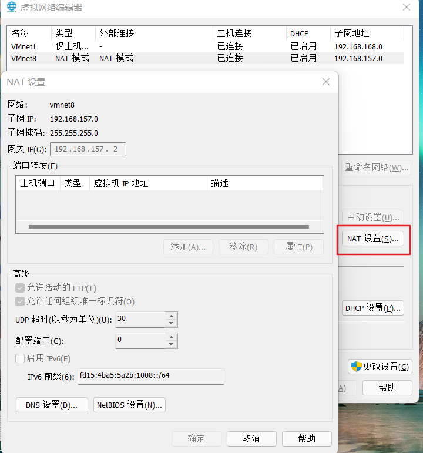
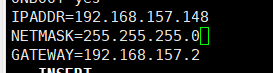

### nat模式主机无法访问外网的解决方案

虚拟机nat模式网卡配置static的时候经常会出现一个问题。明明ssh能访问到该主机(说明虚拟机和使用主机是可以通信的),但是该虚拟机却无法访问到外网了。

这个问题很好解决是网关设置错了,如何查看网关的ip地址呢。vmware的话需要编辑 -> 虚拟网络编辑器 -> 点击NAT设置

最后得到如下图:

此时就可以看到网关地址并不是`xxx.xxx.xxx.1`而是`xxx.xxx.xxx.2`。配置静态网卡的过程中需要如下(以centos 7为例)

注意gateway字段要与网关ip一致才行。此时虚拟机就可以访问外网了。