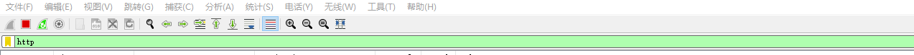
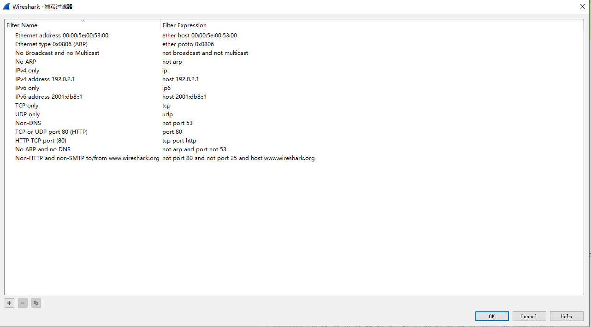

## Wireshark过滤器

数通程序以及写http或通讯基础库都少不了使用wireshark,wireshark使用的核心就在于过滤器的使用。

### wireshark过滤器分类

第一种是捕获过滤器,在抓包之前就设定好的过滤条件,只抓取特定的数据包。



第二种是显示过滤器,在抓包之时或已捕获的数据包集合中设置过滤条件,隐藏不想显示的数据包,只显示符合条件的数据包。

注意:这两种过滤器所使用的语法是完全不同的。捕捉网卡数据的其实并不是Wireshark,而是WinPcap,当然要按WinPcap的规则来，显示过滤器就是Wireshark对已捕捉的数据进行筛选。

使用捕获过滤器的主要原因就是性能。如果知道并不需要分析某个类型的流量,那么可以简单地使用捕获过滤器过滤掉它,从而节省那些会被用来捕获这些数据包的处理器资源。当处理大量数据的时候,使用捕获过滤器是相当好用的。

### 过滤器具体写法

1. 过滤器值比较符号以及表达式之间的组合

在实际例子中可以使用符号也可以使用字符,我个人喜欢使用符号

| 字符        | 符号 | 描述即示例                         |
| ----------- | ---- | ---------------------------------- |
| eq          | ==   | 等于. ip.src==10.0.0.5             |
| ne          | !=   | 不等于. ip.src!=10.0.0.5           |
| gt          | >    | 大于. frame.len > 10               |
| lt          | <    | 小于. frame.len < 128              |
| ge          | >=   | 大于等于. frame.len ge 0x100       |
| le          | <=   | 小于等于. frame.len le 0x20        |
| contains    |      | 包含. sip.To contains "a1762"      |
| matches     | ~    | 正则匹配.`host matches "acme\.(org | com | net)"` |
| bitwise_and | &    | 位与操作.tcp.flags & 0x02          |

2. 多个表达式之间组合

| 字符    | 符号 | 描述即示例                                                 |
| ------- | ---- | ---------------------------------------------------------- |
| and     | &&   | AND逻辑与.ip.src==10.0.0.5 and tcp.flags.fin               |
| or      |      | OR逻辑或.ip.src=10.0.0.5                                   |
| xor     | ^^   | XOR逻辑异或.`tr.dst[0:3]==0.6.29 xor tr.src[0:3]== 0.6.29` |
| not     | !    | NOT逻辑非. not llc                                         |
| `[...]` |      | 见Slice切片操作符                                          |
| in      |      | 见集合操作符                                               |


### 实际案例

1. 针对ip的过滤

- 对源地址进行过滤

```
ip.src == 192.168.0.1
```

- 对目的地址进行过滤

```
ip.dst == 192.168.0.1
```

- 对源地址或者目的地址进行过滤

```
ip.addr == 192.168.0.1
```
    
- 如果想排除以上的数据包，只需要将其用括号囊括，然后使用 "!" 即可

```
!(ip.addr == 192.168.0.1)
```

2. 针对协议的过滤

- 获某种协议的数据包，表达式很简单仅仅需要把协议的名字输入即可

```
http
```

注意:是否区分大小写?答:区分,**只能为小写**

- 捕获多种协议的数据包

```
http or telnet
```

- 排除某种协议的数据包

```
not arp   或者   !tcp
```

3. 针对端口的过滤（视传输协议而定）

- 捕获某一端口的数据包（以tcp协议为例）

```
tcp.port == 80
```

- 捕获多端口的数据包，可以使用and来连接，下面是捕获高于某端口的表达式（以udp协议为例）

```
udp.port >= 2048
```

4. 针对长度和内容的过滤

- 针对长度的过虑（这里的长度指定的是数据段的长度）

```
udp.length < 20   
http.content_length <=30
```

- 针对uri 内容的过滤

```
http.request.uri matches "user" (请求的uri中包含“user”关键字的)
```

注意:matches后的关键字是**不区分大小写**的！

```
http.request.uri contains "User" (请求的uri中包含“User”关键字的)
```

注意:contains 后的关键字是**区分大小写**的！

6. 针对http请求的一些过滤实例。

- 过滤出请求地址中包含“user”的请求，不包括域名；

```
http.request.uri contains "User"
```

- 精确过滤域名

```
http.host==baidu.com
```

- 模糊过滤域名

```
http.host contains "baidu"
```

- 过滤请求的content_type类型

```
http.content_type =="text/html"
```

- 过滤http请求方法

```
http.request.method=="POST"
```

- 过滤tcp端口

```
tcp.port==80
```

```
http && tcp.port==80 or tcp.port==5566
```

- 过滤http响应状态码

```
http.response.code==302
```

- 过滤含有指定cookie的http数据包

```
http.cookie contains "userid"
```

### 捕获过滤器写法

wireshark中点击`捕获`->`捕获过滤器`可以看到一些过滤器写法,如下:

